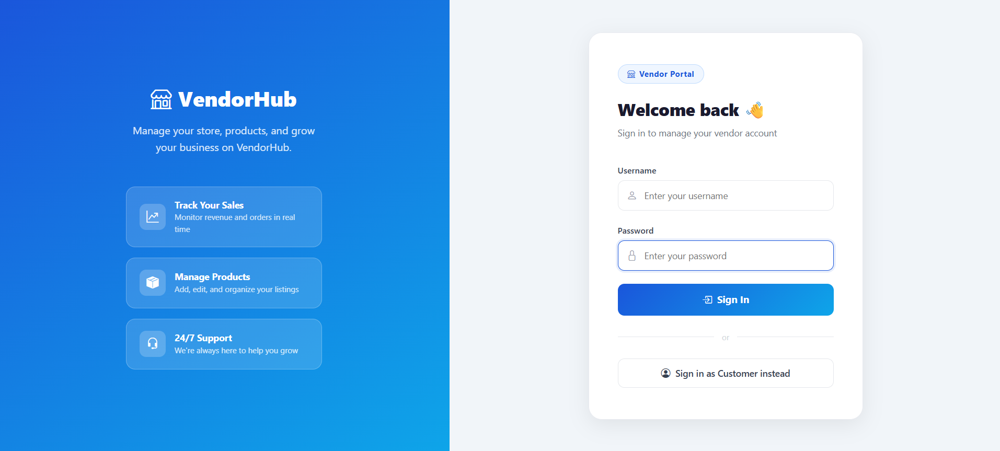
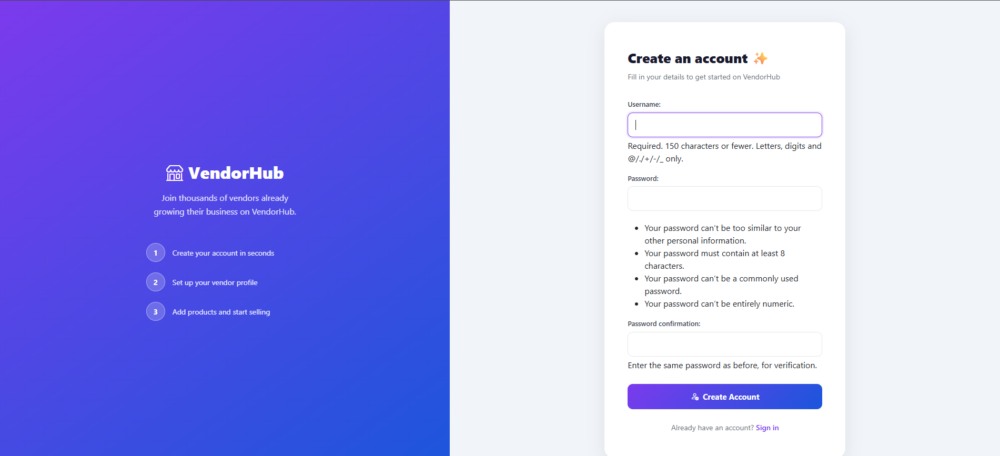
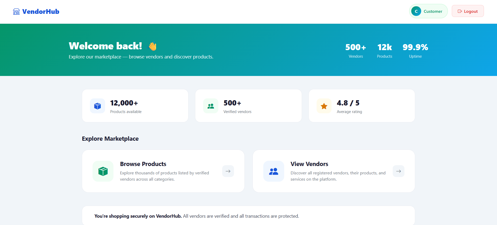
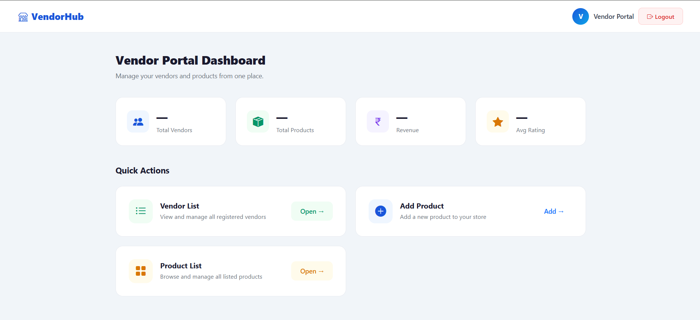
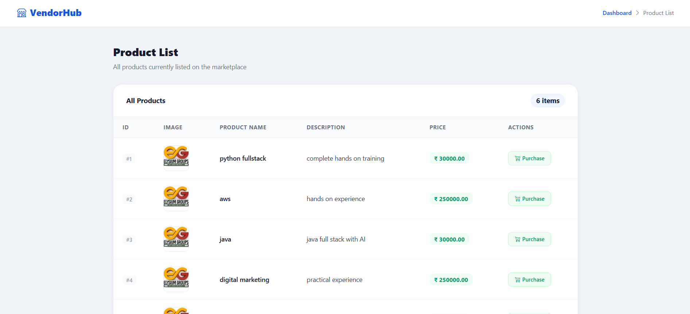
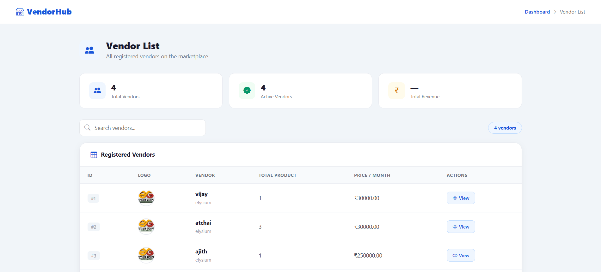

🛒 Multi Vendor Marketplace System

A full-stack **Multi Vendor Marketplace** web application built using **Django**, **Python**, **MySQL**, and **Bootstrap**.

This project allows multiple vendors to manage their products while customers can browse products through a responsive web interface.

---

📌 Features

👤 User Authentication
- User Registration
- User Login
- Logout
- Secure Authentication
- Session Management

🏪 Vendor Management
- Vendor Dashboard
- Add Vendor
- Update Vendor
- Delete Vendor
- Upload Company Logo

📦 Product Management
- Add Products
- Edit Products
- Delete Products
- Product Listing
- Product Images

🎨 User Interface
- Responsive Bootstrap Design
- Dashboard Pages
- Navigation Bar
- Image Upload Support
- Clean UI

---

🛠 Tech Stack

| Technology | Used |
|------------|------|
| Python | ✅ |
| Django | ✅ |
| MySQL | ✅ |
| HTML5 | ✅ |
| CSS3 | ✅ |
| Bootstrap 5 | ✅ |
| JavaScript | ✅ |
| Pillow | ✅ |

---

📂 Project Structure

```
multi-vendor-marketplace/
│
├── vendor/
│   ├── models.py
│   ├── views.py
│   ├── forms.py
│   ├── urls.py
│   └── templates/
│
├── products/
│   ├── models.py
│   ├── views.py
│   ├── forms.py
│   ├── urls.py
│   └── templates/
│
├── multivendar/
│   ├── settings.py
│   ├── urls.py
│   └── wsgi.py
│
├── logos/
├── media/
├── manage.py
└── requirements.txt

```
---

🚀 Installation

1️⃣ Clone Repository

```bash
git clone https://github.com/Dharani007-bot/multi-vendor-marketplace.git
```

---

2️⃣ Move to Project

```bash
cd multi-vendor-marketplace
```

---

3️⃣ Create Virtual Environment

Windows

```bash
python -m venv .venv
```

Activate

```bash
.venv\Scripts\activate
```

---

4️⃣ Install Dependencies

```bash
pip install -r requirements.txt
```

---

5️⃣ Configure Database

Open

```
settings.py
```

Update your MySQL database credentials.

```python
DATABASES = {
    'default': {
        'ENGINE': 'django.db.backends.mysql',
        'NAME': 'your_database',
        'USER': 'root',
        'PASSWORD': 'password',
        'HOST': 'localhost',
        'PORT': '3306',
    }
}
```

---

6️⃣ Run Migrations

```bash
python manage.py makemigrations

python manage.py migrate
```

---

7️⃣ Create Superuser

```bash
python manage.py createsuperuser
```

---

8️⃣ Start Server

```bash
python manage.py runserver
```

Open

```
http://127.0.0.1:8000/
```

---


## 📸 Screenshots2

Home Page


Login page


Register


Customer Dashboard


Vendor Dashboard


Product List


Vendor List


